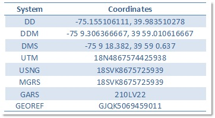
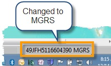
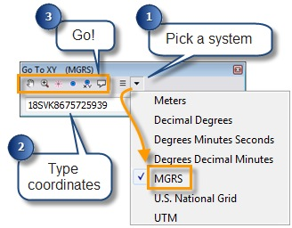
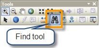
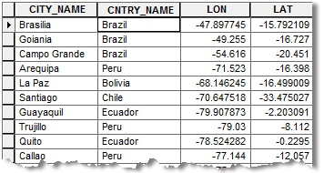
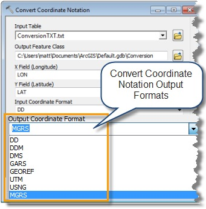
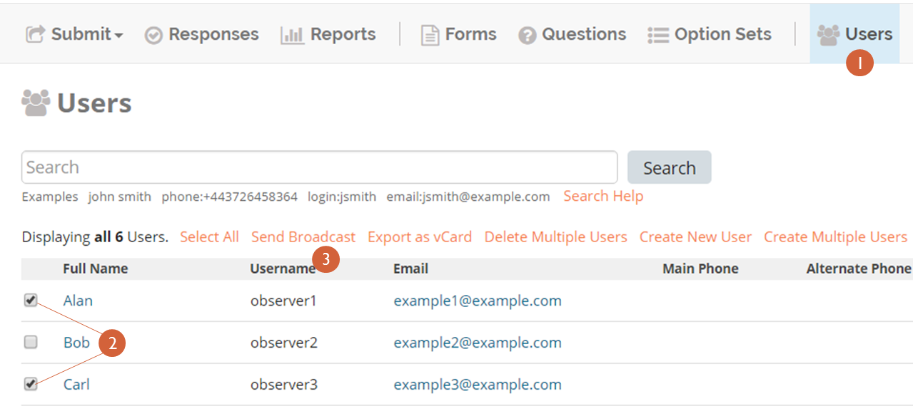
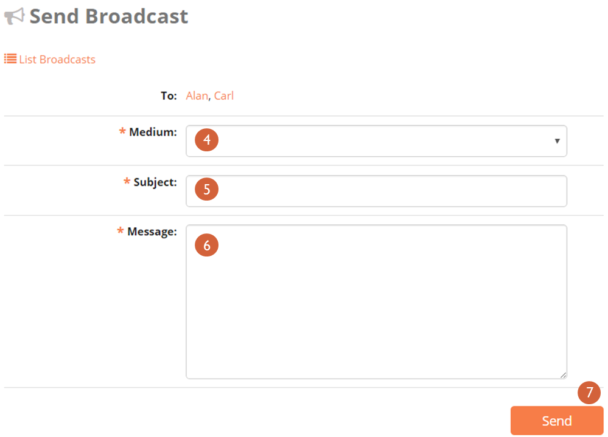

12. Additional features and information
~~~~~~~~~~~~~~~~~~~~~~~~~~~~~~~~~~~~~~~

12.1. Broadcast messages
^^^^^^^^^^^^^^^^^^^^^^^^

Coordinators may want to broadcast messages to observer teams in the
field in the instance of a change of polling location, schedule, or
another event. Administrators and coordinators can send Broadcasts via
email or SMS to individual users or all active users on a mission.

Please note that you need an ELMO SMS gateway with SMS credit
established before messages can be sent.

To send a Broadcast Message:

1. Click the **Users** menu
2. Select the user(s) to receive a message by marking the boxes next to
   their name(s)

       **NOTE:** Observers **do NOT** have the ability to reply to
       broadcast messages – instruct observers to contact the observer
       coordinator directly if they need to discuss a broadcast message
       or other issue.

3. Click **Send Broadcast**—this action will direct to a page where
   the medium of the broadcast can be selected, and the subject and its
   content can be entered into a text field
   |broadcast selection edited|
4. Select a medium from the drop down list:

   1. **SMS preferred**: will try to send a SMS and then an email, if
      unsuccessful
   2. **Email preferred**: will try to send an email and then an SMS
      if unsuccessful
   3. **SMS only**: will send only SMS
   4. **Email only**: will send only email
   5. **Both SMS and Email**: will send both SMS and email

5. Type a subject in the Subject line
6. Type your broadcast message in the Message box
7. | Click **Send**
   |  |broadcasts edited|

12.2. Converting and Displaying GPS Coordinates in ARcGIS 10
^^^^^^^^^^^^^^^^^^^^^^^^^^^^^^^^^^^^^^^^^^^^^^^^^^^^^^^^^^^^

There are many ways of representing locations.  One of the most common
uses angular latitude and longitude coordinates to specify the location
of a point.  These `Geographic
coordinates <http://en.wikipedia.org/wiki/Geographic_coordinate_system>`__
may be expressed in several different notations, including Decimal
Degrees (DD), Degrees Decimal Minutes (DDM), and Degrees Minutes and
Seconds (DMS). The formula for `converting Degree Minutes and Seconds to
Decimal
Degrees <http://help.arcgis.com/en/arcgisdesktop/10.0/help/index.html>`__
is discussed in the ArcGIS 10 Help.  Another common method is to use a
projected coordinate system and X and Y coordinate pairs, that is, two
sets of numbers in a planar Cartesian system.

Gridded systems, like Universal Transverse Mercator
(`UTM <http://en.wikipedia.org/wiki/Universal_Transverse_Mercator_coordinate_system>`__),
United States National Grid
(`USNG <http://en.wikipedia.org/wiki/USNG>`__), Military Grid Reference
System (`MGRS <http://en.wikipedia.org/wiki/MGRS>`__) divide the world
into zones which are projected and then overlaid with one or more
grids.  Within the grids, point locations are specified by their
position East and North the zone origin or the southeast corner of the
cell. For USNG and MGRS the numeric values of the northing and easting
can vary from 1 to 5 digits, depending on the precision of the location
(they must both use the same number of digits) and then the values are
concatenated.

Two less frequently used systems, the Global Area Reference System
(`GARS <http://en.wikipedia.org/wiki/Global_Area_Reference_System>`__)
and Geographic Reference System
(`GEOREF <http://en.wikipedia.org/wiki/Georef>`__), divide the world
into polygonal areas based on different sets of nested grids and encode
locations as a string of grid ID values.

Each of these ways of representing a location results in different
strings of characters with a variety of formats.  This table shows the
coordinate representation for Philadelphia, Pennsylvania in the US (75°
9’ 18.382” West longitude by 39° 59’ 0.637” North latitude) in each of
these systems.  This is not an exhaustive list of the delimiters and
hemisphere indicators that are used in each system.

ArcGIS 10 can convert coordinates expressed in each of these systems
into the others, and provides ways of displaying and accepting
coordinate input in most of them.

**Displaying Coordinates**

.. figure:: arcgis-2.png
   :alt: arcgis 2

You can see the coordinate value for a place on a map in the ArcMap
status bar, at the bottom right of the application. The default
coordinate format in the status bar is based on the units of the first
layer added to the map, often feet, meters, or degrees of
longitude/latitude.

You can change the coordinate display to use any of these systems
(except GARS and GEOREF) by right-clicking Layers in the table of
contents and selecting Properties. On the General tab, under Units, you
can select the type of coordinates you would like to see, for example
MGRS.

**Go To XY Coordinates**

.. figure:: arcgis-4.png
   :alt: arcgis 4

If you have a set of coordinates and you want to find their location on
the map, you can use the Go To XY tool.

Open the tool from the toolbar, then select a coordinate format. Type
(or paste) the coordinates into the text box and click one of the
buttons to Pan to, Zoom to, Flash, Add a Point, Add a Point Labeled with
Coordinates, or Add a Callout.

The Go To XY tool also keeps a record of recent locations, which you can
return to by clicking the Recent button and selecting the location. You
can use this to manually convert coordinates from one format to another.
To do so, select your input coordinate notation, input your coordinates
and pan to the location. Then select your new output format and select
the coordinates from the Recent button.

**Find MGRS coordinates**

If you work with MGRS coordinates, the Find tool has an MGRS Locator
that works like the Go To XY tool, but provides additional capabilities
tailored to the MGRS system.

.. figure:: arcgis-7.png
   :alt: arcgis 7

To use these, open the Find tool on the Tools toolbar.  In the Find tool
dialog box, click the Locations tab, select MGRS from the locator
drop-down list.  Then type (or paste) the coordinate into the MGRS box
and click Find.

.. figure:: arcgis-8.png
   :alt: arcgis 8

The tool will return a list of location matches (in our case there
should only be one). If you right-click on the coordinate you have
various options for marking the location.

So what’s different about the MGRS Locator?

The locator has options for matching shortened MGRS coordinates when you
work in the same Grid Zone Designator (GZD).  It has options to pull the
GZD and 100,000 meter square identifier from the current map center, a
default value, or use the last one used. This is convenient if you work
in the same GZD over and over again, you can type “8675725939” or
“VK8675725939” rather than “18SVK8675725939”, which will save you a few
extra key strokes when entering your coordinates.

**Converting Tables of Coordinates**

There may be times when you have a lot of coordinates that you need to
convert to another system.  If you have the coordinates in a table, you
can convert all of them by running the Convert Coordinate Notation (CCN)
geoprocessing tool.

For example, you might convert a table of longitude and latitude values
in decimal degrees (DD) to MGRS.

With the CCN tool you can convert between DD, DDM, DMS, UTM, USNG, MGRS,
GARS, and GEOREF.

The tool takes your table of coordinates and converts them to point
features with an attribute containing the new output notation.

It is important to note that the CCN tool is a geoprocessing tool and
represents a single-focus process of converting a table of coordinates;
its only function is to do the conversion. The output point features do
not have the same fields as the input table.

If you want the output points to have  all of the attributes of the
input table (in addition to the new notation field) you must put the
tool in a `Model Builder
model <http://help.arcgis.com/en/arcgisdesktop/10.0/help/index.html>`__
that uses the `Join Field
tool <http://help.arcgis.com/en/arcgisdesktop/10.0/help/index.html>`__
to attach the original fields.

The model would look something like this:

.. figure:: arcgis-11.png
   :alt: arcgis 11

This table lists the coordinate notations mentioned above, and shows the
different tools and functions that support them.

.. figure:: arcgis-12.png
   :alt: arcgis 12

*Content provided by Matt Funk*

12.3. Device Security
^^^^^^^^^^^^^^^^^^^^^

Data sent to ELMO should be set up securely using HTTPS
(**Administrators take note!**). In addition, each physical device
should also be secured. Here are some security methods you might
consider:

1. Use a Screen Lock
2. Encrypt Device with SD Card Encryption
3. Turn off Developer Options
4. Protect Device from Harmful Applications
5. Delete forms automatically after being sent in ODK Collect

These suggestions are covered in more detail below. They are just here
for your consideration; you should refer to the Android Quick Start
Guide for more information. If your device is on Android version 5.x,
`click
here <https://play.google.com/books/reader?id=dnzVBAAAQBAJ&printsec=frontcover&output=reader&hl=en&pg=GBS.PR1>`__;
if it is on 6.x, `click
here <https://play.google.com/books/reader?id=tu6bCgAAQBAJ&printsec=frontcover&output=reader&hl=en&pg=GBS.PP1>`__.

12.3.1. Use a Screen Lock
'''''''''''''''''''''''''

Think of a screen lock as a password to unlock a phone. Using a screen
lock is important for security. If someone is in physical possession of
a device, to access the device’s information, they will need to know how
to unlock the device.

Android has several options for screen locks. These include drawing a
pattern, a numerical keyphrase, and a text passphrase. On newer devices,
fingerprint scanning is also possible as a screen lock.

A screen lock should allow the user of the device easy access to the
device and their data, but should be difficult for someone else to guess
or access.

**Opening the Screen Lock Menu**

To change screen lock settings, go to the main settings menu and look
for a Lock Screen, Screen Lock, or Security or something similar.

**Android 6.0 and up**

*Settings > Security > Screen Lock*

Open the device’s Settings application. Look for Security and select it.
Then select Screen Lock.

**Android 5.0**

*Settings > Lock screen*

From the Home screen, pull down the main menu by swiping down. The gear
menu in the right corner opens Settings. Inside Settings, find and
select Lock Screen.

**Changing The Screen Lock**

Once inside the screen lock menu, select the screen lock you wish to
use. You will be guided through how to change the screen lock. The
screen lock options available depend on each device, its operating
system (OS), and the version of the OS on the device.

12.3.2. Encrypt Device with SD Card Encryption
''''''''''''''''''''''''''''''''''''''''''''''

If a device is lost, stolen, or in someone else’s possession, they may
be able to gain access to the data on the device by physically accessing
the data card. Encryption stores data in a scrambled state. Encryption
ensures that only those with credentials can unscramble or unencrypt the
data and read it.

According to Android documentation: “Encryption stores… data in a form
that can only be read if you have the right credentials. This can
provide additional protection in case [a] device is stolen.” (1) Types
of data that can be encrypted include “account data, app data, music and
other media, and downloaded information.”
`(source) <https://support.google.com/nexus/answer/2844831>`__

**To Access Encryption Settings**

In the main settings menu, look for *Security* or similar. Inside the
security screen, look for *Encryption*, *Encrypt phone*, *Encrypt
tablet*, or similar.

**Android (5.0, 4.4 and lower)**

*Settings > Security > Encrypt [device]*

**Encrypting Your Device**

Inside the Encryption menu, follow the instructions on the screen to
encrypt the device. You will need to have access to a charger and set
aside an hour or more for the encryption process.

**Use Encryption with a screen lock**

It is recommended to use a screen lock if encryption is used on a
device. Without a screen lock, encryption’s security protection is
reduced.

Some devices require a screen lock if encryption is enabled. Some
devices only allow certain types of screen locks to be used, such as a
pin or password, when encryption is enabled.

12.3.3. Turn off Developer Options
''''''''''''''''''''''''''''''''''

Developer options are settings within the Android system that allow a
device to be used to develop and debug an application. If you are not
actively testing an application, you do not need to keep developer
options on.

**Determine If You Have Ever Activated Developer Options**

By default, developer options are completely hidden in Settings. Look in
the main settings menu. Is there an option listed for *Developer
Options* or something similar?

If not, developer options have not been activated on the device. You can
skip the remaining steps in this section.

If *Developer Options* or something similar is listed, you should follow
the next steps to secure the device.

**Open Developer Options**

*Settings > Developer Options*

**Turn Off Developer Options**

Once *Developer Options* is open, turn off *Developer Options*.

Inside *Developer Options*, if you see that *Developer Options* are
already turned off on this device, this device is protected. You can
skip the remaining steps in this section.

Turning off *Developer Options* may involve moving a toggle from the
“\ *on*\ ” to “\ *off*\ ” position. Or it may involve deselecting all
options so that no checkboxes remain checked.

**Android 5.0**

On the top bar inside *Developer Options*, switch the toggle from *On*
to *Off*. You will know *Developer Options* are turned off when the
options on the screen are grayed out.

12.3.4. Protection from Harmful Applications
''''''''''''''''''''''''''''''''''''''''''''

Each time an application is installed, it has the potential to access
data and media, information about other apps, geolocation, and a great
deal of information about each device. It is important to install only
trusted applications and to remove any applications that are not
trusted.

After the initial install of necessary programs on the device, such as
ELMO software, device preparers can add security measures to protect
against harmful applications.

**Use the Approved Application Store**

It is recommended to install applications through the operating system’s
approved application store. For Android devices, this means most
applications should be installed through *Google Play Store*. The
applications found in the operating system’s approved application store
have been vetted to ensure the application does not contain malware.
Despite this, it is possible for an application from the approved
application store to be rouge in some way, including asking for
permissions to information on your device that it does not need. It is
good practice for election observers and device preparers to only
install programs that are needed and trusted.

**Turn Off Unknown Sources**

To ensure only applications from the approved application store can be
used, device prepares can turn off the *Unknown Sources* setting.

Inside the device’s settings, look for a setting related to types of
applications that can be installed. On some devices, this may mean
making sure the box marked next to *Unknown Sources* is not checked or
to uncheck it, if needed. On other devices, there may be a different way
to turn off *Unknown Sources*.

**Android 5.0**

*Settings > Security > Phone Administration > Unknown Sources*

**Turn on App Verification**

App verification ensures that an application undergoes a security check
on install and periodically. Look for a setting inside the main settings
security menu related to “\ *app verification*,” “\ *verify apps*,” or
something similar. Ensure that application verification is enabled.

**Android 5.0**

*Settings > Security > Phone Administration > Verify Apps*

Make sure the box next to Verify apps is checked.

**Android 6.0**

1. Access *Google Settings*. You can use one of these methods:

   1. Open the *Settings* Touch *Google*.
   2. Open the *Google Settings*

2. Inside *Google Settings*, touch *Security*.
3. Under *Verify Apps*, ensure that *Verify Apps* is turned on and turn
   on *Scan device for security threats*.

**Uninstall questionable applications**

If questionable apps have been installed on a device or there are
applications that are no longer needed on the device, it is recommended
that these applications be uninstalled for added security.

12.3.5. ODK Collect: Delete after sending forms
'''''''''''''''''''''''''''''''''''''''''''''''

In case you are worried about sensitive information you’ve collected and
“what if I lose my device,” you may want to also consider removing any
filled out forms on the ODK Collect app after they have been submitted
and received by ELMO.

The “Delete After Send” option is available through ODK Collect
settings. For more information, please visit https://opendatakit.org/.

