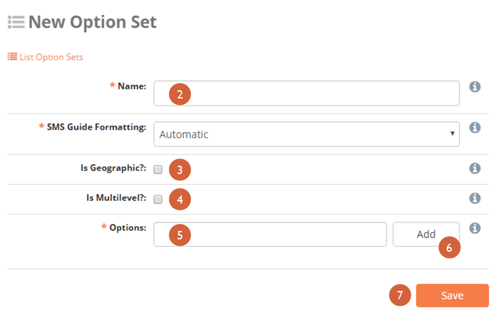
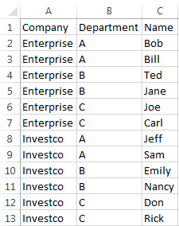
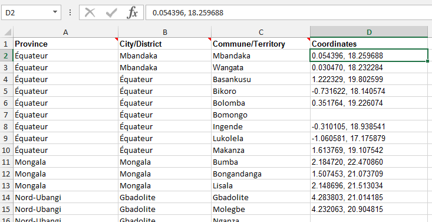

### 6.Forms: Option Sets

The Option Sets page is where the answers for Select One (ex. “What color is your shirt?”) and Select Multiple (ex. “What kinds of food do you like?”) question types can be created. Click the _**Option Sets**_ menu on the main menu bar to create or edit existing Option Sets.

#### 6.1. Create New Option Set

1.  Click **_Create New Option_** **_Set_** link available from the **_Option Sets_** menu. Option set settings appear:  
    
2.  In the box marked **_Name_**, create a unique name that summarizes the Option Set being created.
    1.  Observer users will not be able to view this name
3.  If this Option Set represents geographic information, check the box labeled **_Is Geographic?_** (i.e. a set of provinces or regions). Responses that are geographic can also appear on the map in the Dashboard, even if SMS-based.
    1.  If the options contain coordinates, check the box labeled **_With Coordinates?_**
4.  If this Option Set needs multiple levels, check the box labeled **_Is Multilevel?_** (i.e. example that is non-geographic like the example below?). See more information on Multilevel sets below.
    1.  Click _**add level**_ to add a level
    2.  Type the name of the level (i.e. province or region)
    3.  Click **_Save_**
5.  Enter the different options for the option set in the box labeled **_Options_**
6.  In the Options box, add existing options by typing them and clicking **_Add_**. If an option in the drop down menu is not visible, add a new one by clicking **_Create New_** **_Option_**
    1.  The **_Options_ **box allows multiple options to be typed at once and added or created together by separating option names by commas. Conclude by clicking **_Add_**
7.  Click **_Save_**

**Multilevel option sets.** Checking the _**Is Multilevel?**_ box allows for the use of hierarchically organized options. For example, if the question is _Where do you live?_, you may want to allow for the selection of a certain Country (a level) that always contains a set number of Provinces or States (another level) which have certain Cities within each (one more level):

Country: United States-> Province/State: Georgia-> City: Atlanta or

Country: Democratic Republic of Congo -> Province/State:Nord-Kivu -> City: Goma

At this time, Multilevel Option Sets can only be used for Select One type questions.

To create a Multilevel Option Set:

1.  Check the box labeled _**Is Multilevel?**_
2.  Click _**Add Level**_
3.  Type the name of the level and click _**Save**_
4.  Repeat step 3 until all levels have been created
5.  Click and drag levels so that the first level is at the top and the last level is at the bottom. Do not indent levels:  
     [
6.  Add options
7.  Click and drag options so that options of any level below the first are beneath and indented to the right of the options of the level they are within.
8.  Click _**Save**_

In the above example, Species is the first level of the hierarchy and Role is the second. Human, Dog, and Cat are options of Species, and Mom, Dad, Brother, and Sister are options of Role. Note that Dog and Cat do not have options on the Role level. Also note that when using a Tablet, the user must first choose an option at the Species level before swiping to the next page to view the available options at the Role level.

Option Sets can also be created with spreadsheet software, like Excel, and uploaded directly into ELMO:

1.  Outside of ELMO, create a CSV or XLS file
2.  In the first row, include the name for each level as an individual column header(e.g. Company | Department | Name ).
3.  Add the names of the options  
    
4.  In ELMO, click on the **_Option Set_ **menu
5.  Click **_Import New Option Set_**
6.  Create a Name for the option set
7.  Choose the CSV or XLS file created in steps 1-3
8.  Click **_Import_**
9.  If the option set is really large, the upload may be sent to **_Operations Panel_**. You will be able to work on other tasks while the upload continues in the background. You can also click on the **_Operations_** link to check if your upload was successful

#### 6.2. Edit existing Option Set

1.  Click the **_Option Sets_** menu
2.  Click the Option Set requiring editing by selecting the corresponding **_Pencil icon_**
3.  Click **_Save_**

Note that if you wish to edit a large option set imported via CSV or XLS file, you cannot directly edit the options in ELMO. You will need to edit the original file and import it again. The edited file should be imported under a different name, as importing it under the same name will create another option set with the same name, which could lead to confusion. For example, if an option set was imported and named LOS, the edited option set should be imported under the name LOS #2 or something similar, because naming it LOS will result in a second option set named LOS being created, not the replacement of the first one.

#### 6.3. Import Standard Option Set

1.  Click **_Import Standard Option Sets_**
2.  Click the boxes next to the option sets to be imported
3.  Click **_Import_**

#### 6.4. Importing large option sets

1.  Click **_Import New Option Set_**
2.  Type a name for your option set in the box
3.  Click **_Choose File_**
4.  Select an XLS or CSV file
5.  Click **_Import_**

#### 6.5. Upload a Large Geographic Option Set

To upload a large geographic option set:

1.  Outside of ELMO, create a CSV or XLS file
2.  In the first row, include the name for each level as an individual column header with “Coordinates” as the last column (e.g. Province | City | District | Coordinates )
3.  Add the name for each level
4.  In the column for “Coordinates,” include both latitude and longitude in decimal format separated by a comma (e.g. 0.054396, 18.259688)

> **_NOTE_**_:To_ _find latitude and longitude coordinates in decimal format:_  
> _In Google Maps:_  
> _1\. Open Google Maps_  
> _2\. Right-click the place or area on the map_  
> _3\. Select_ **_What’s here?_**  
> _4\. A card appears at the bottom of the screen with more info_
> 
> _In  ArcGIS:_ **_Please view Appendix_**

Example:

Country   | State  | City       | Coordinates

USA        | GA     | Atlanta  | 33.747082, -84.380101

1.  In the mission you are working on, click on the **_Option Set_ **menu
2.  Click **_Import New Option Set_**
3.  Create a Name for your option set
4.  Choose the CSV or XLS file you created
5.  Click **_Import_**
6.  If the option set is really large, the upload may be sent to **_Operations Panel_**. You will be able to work on other tasks while the upload continues in the background. You can also click on the **_Operations_** link to check if your upload was successful.

#### 6.6. Language translations

Options within an Option Set can be translated in a manner similar to translating questions. To translate an option:

1.  Either create a new option set and add options or edit an existing option set
2.  Click the **_Edit_** icon adjacent to the option to be translated
3.  Type the translation in the box next to the language being translated to
4.  Click **_Save_**
5.  Note that the two-letter language code for every existing translation appears next to the option name
6.  Click **_Save_**
