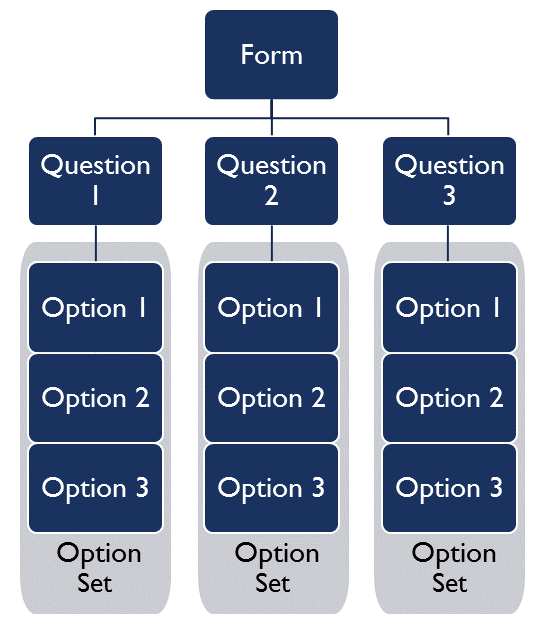
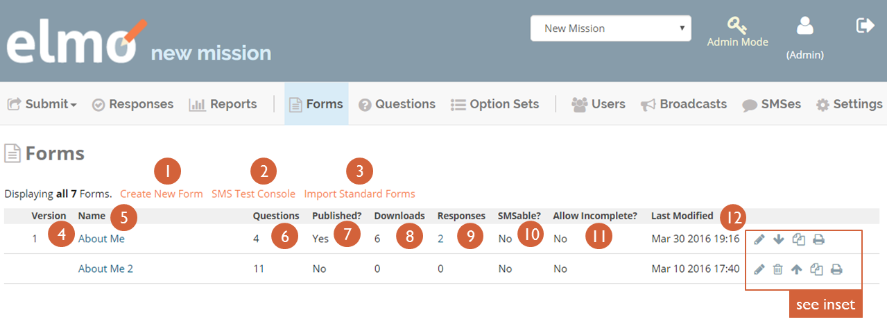
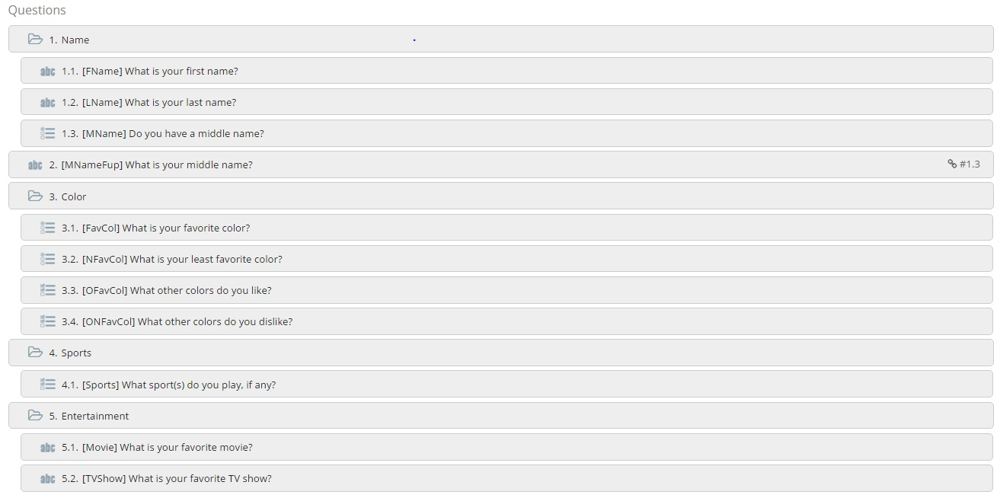
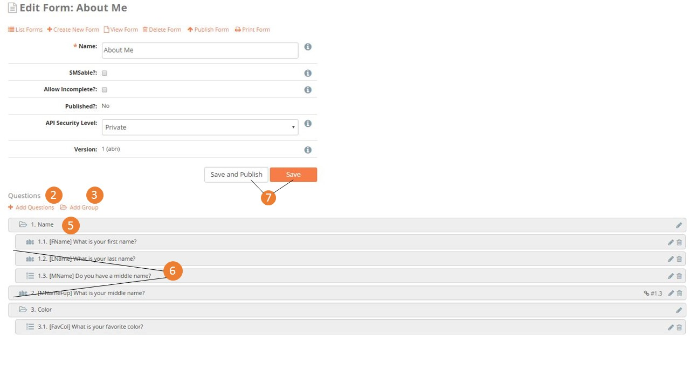
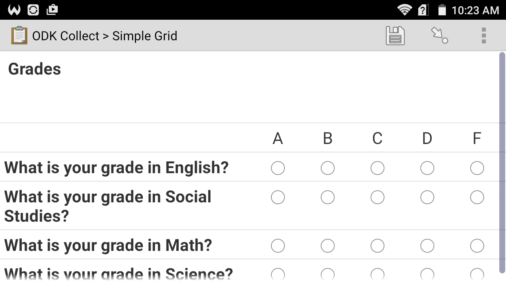
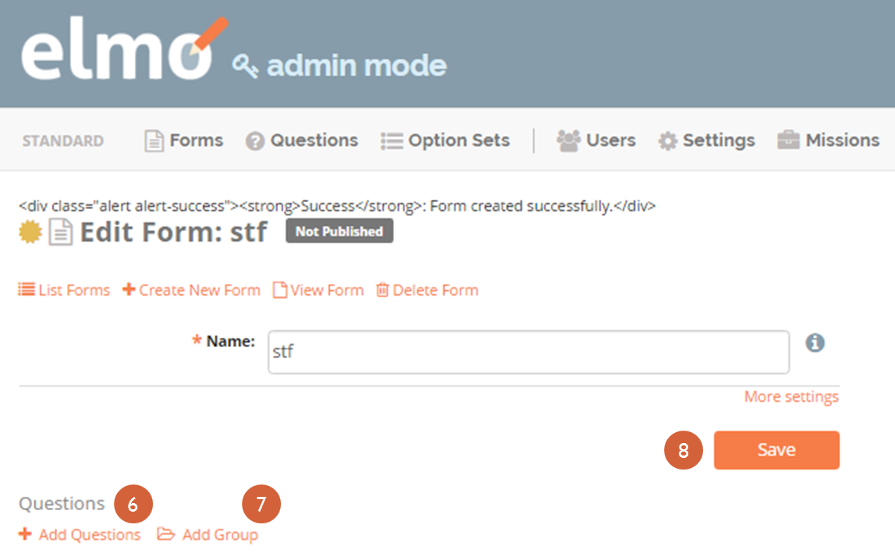

### 4. Forms: Overall

#### 4.1\. Overall structure of Forms

Forms, Questions, and Option Sets can all be standardized in ELMO. Standard Forms, Questions, and Option Sets eliminate the need for observation groups to remake checklists for every mission, and allows users to compare findings across missions. While election administration is largely similar from country to country, specific regulations can vary by country, and so should the design of the form, the questions in it, and the answers available. ELMO allows for customized design of forms for the mission at hand.

Standardization in ELMO Forms is a major aspect of The Carter Center’s overall [Democratic Election Standards project](http://electionstandards.cartercenter.org/). The project aims to build consensus on obligations for democratic elections and on detailed criteria for assessment by advancing the evolution of standards for democratic elections and increasing shared knowledge on election integrity, election observation, and democracy promotion. To do so, the project uses a [framework of obligations](https://eos.cartercenter.org/) derived from public international law, collaborates with the international elections community, and develops practical tools – like ELMO – for observers to assess elections. Standard Forms, Questions, and Option Sets not only allow for ease of mission development, but also are used by The Carter Center to increase coordination between the international elections community and human rights mechanisms, providing capacity-building on international obligations to civil society groups, build consensus on common indicators for election quality with the academic community, measure the impact of election observation, and maintain and develop shared knowledge on observation methodology.

Building a new form involves the following steps:

1.  Creating a new form
2.  Creating questions for the form
3.  Depending on the question type, creating option sets for those question

In ELMO, these steps can be done in any order. In addition, forms, questions, and option sets can be reused both within a mission and across missions, depending on whether they are created in Mission Mode or Admin Mode. They can also be edited at any time.

#### 4.2\. Forms menu

The **_Forms_** menu lists all the available forms for a mission. These are the components:

1.  **_Create New Form_**: click this to create a new form
2.  _**SMS Test Console**_: click this to test form submission via SMS
3.  _**Import Standard Forms**_: click this to import standard forms to the mission; these forms can be edited within the mission

Once a form has been created, these components appear on the _**Forms**_ menu

5.  _**Version**_: this column shows the version numbers of the forms that have been published
6.  _**Name**_: this column shows the name of each form
7.  _**Questions**_: this column shows the number of questions in each form
8.  _**Published?**_: this column displays a _**Yes**_ if a form has been published, and a _**No**_ if it has not been published
9.  _**Downloads**_: this column shows the number of times each form has been downloaded
10.  _**Responses**_: this column shows the number of responses to each form that have been submitted
11.  _**SMSable**_?: this column displays a _**Yes**_ if a form can be submitted via SMS, and a _**No**_ if it cannot be submitted via SMS
12.  **_Allow Incomplete?_**: this column displays a _**Yes**_ if a form allows incomplete submissions, and a _**No**_ if it does not allow incomplete submissions
13.  _**Last Modified**_: this column shows the date and the time that each form was last edited
14.  The _**Edit**_ icon: click this to edit the form in this row
15.  The _**Delete**_ icon: click this to delete the form in this row; this can only be done for forms that are unpublished
16.  The _**Publish**_ icon: click this to publish the form in this row; this can only be done for forms that are unpublished
17.  The _**Unpublish**_ icon: click this to unpublish the form in this row; this can only be done for forms that are published
18.  The _**Clone**_ icon: click this to create an identical copy of the form in this row
19.  The _**Print**_ icon: click this to print the form in this row

In Admin Mode, the _**Forms**_ menu only contains the following components:

1.  _**Create New Form**_
2.  _**Name**_
3.  _**Questions**_
4.  _**Copies**_: this column shows the number of missions each form has been imported to
5.  _**Copy Responses**_: this column shows the number of responses to each form that have been submitted across all
6.  _**Last Modified**_
7.  The _**Edit**_ icon
8.  The _**Delete**_ icon
9.  The _**Clone**_ icon
10.  The _**Print**_ icon

#### 4.3. Importing Standard Forms

Forms used on different missions often contain similar or even identical questions. In ELMO’s Admin Mode, administrator-level users can create standard forms, questions, and option sets that remain stored in the ELMO system and can be imported into any mission. The option to import standard forms eliminates the need to create new forms for every mission. Standard forms also allow for an easier comparison of data across missions. Mission staff should import the standard versions of option sets, questions, and forms that are not country specific and are used repeatedly, such as the question “How many ballots were spoiled?” or the Option Set “Yes/No/N/A/Didn’t observe.”

To import a Standard Form:

1.  Go to the _**Forms**_ menu in the mission
2.  Click_ **Import Standard Forms**_
3.  Choose Forms to import to the mission

> _**NOTE**: Remember to select Admin Mode to create standard forms. If the Admin Mode link does not appear on the screen, permission is not granted to create standard forms. ELMO Administrators can create and edit standard forms, standard questions, and standard option sets with the same actions used for general forms, questions, and option sets, but these actions must be performed in Admin Mode._

#### 4.4. Creating a General Form

Forms are composed of _questions_. Some questions require users to select from a set of previously-defined responses (multiple choice, yes/no, etc.), while others require the user to enter text or numeric values. Building a new form involves the following steps: creating a new form; creating questions for the form; and depending on the user’s needs, creating option sets for those questions. In ELMO, these steps can be done in any order.

1\. To create a new Form:

1.  Go to the Forms page by clicking on the _**Forms**_ menu on the main menu bar
2.  Click the **_Create Form_** link located under the Page title
    1.  Give the form a name.

    That’s all you have to do, but if you want to do more, click _**More Settings**_:

    1.  Check the _**SMSable**_ box if you want to be able to receive responses to the form via SMS
    2.  Check the _**Allow Incomplete**_ box to allow forms to be submitted without required questions filled in. This is not typically desired, but an option if necessary
3.  Click **_Save_**

2\. To add questions to the Form:

1.  Return to the Forms page
2.  Click the **_Pencil icon_** located on the same line as the desired form
3.  Click the **_Add Questions_** icon:
    1.  Select from existing questions in the question bank
    2.  Create a new question to add to the Form (see _Questions_ section below for detailed instructions)
4.  Click **_Save_** when finished editing

#### 4.5. Creating Groups and Grids

A new feature in ELMO 5.x is the ability to create and sort groups of questions. Groups, in essence, keep questions together so that they appear on the same page. This feature serves several purposes, including:

1.  Making it easier for administrators to create and sort questions within forms.
2.  Making it easier for users to fill out forms by:
    1.  placing multiple questions on one page, thereby reducing the number of times a person has to swipe, and
    2.  creating “grids” with Select One questions (see below), to make it easier to answer related questions at once.

Here is an example of a few groups:

Note that questions do not have to be part of a group, nor does a group have to consist of multiple questions. A group can have one question or no questions, but this would make the group redundant.

Groups have some restrictions:

1.  Groups cannot be placed within questions or other groups.
2.  Groups cannot be made conditional or hold both [conditional questions](../formsoverall/formsoverall.html) and the questions that trigger them.

To create a form with groups:

1.  Create a form
2.  Create or add questions to the form
3.  Create at least one group
    1.  Click **_Add Group_**
    2.  Give the group a unique name
    3.  Click **_Save_**
4.  Click and drag the questions in the desired order of appearance, with the first question on top and the last one on the bottom
5.  Repeat step 4 for the groups. Groups must be placed directly above the first question that is intended to appear within that group
6.  Drag questions intended for groups to the right so that they appear indented in relation to the group. If a question is intended to appear by itself, do not drag it right; leave it where it is
7.  Click **_Save_** to save the form, or click **_Save and Publish_** if the form is ready to be used

Groups can be used to create grids, an example of which is shown below.

Grids can only be created under certain conditions:

1.  Questions must be in the same group.
2.  Questions must be “Select One” questions.
3.  Questions must have the same option set.

To create a grid:

1.  Create a form.
2.  Create a group.
3.  Place “Select One” questions with the same option set in the group.
4.  Click **_Save_** to save the form, or click **_Save and Publish_** if the form is ready to be used.

#### 4.6. Creating a Standard Form

The process of creating a Standard Form is similar to that of creating a General Form. To create a Standard Form:

1.  Click **_Admin Mode_**
2.  Click the **_Forms_** menu
3.  Click **_Create New Form_**
4.  Type a name for the form in the text box next to **_Name_**
5.  Click **_Save_**  
    
6.  Click **_Add Questions_** to add questions to the form
7.  Click **_Add Groups_** to add groups to the form
8.  Click **_Save_**  
    

#### 4.7. Publishing a Form

Once a form has been created, it must be published before it can be accessed by observers, completed, and submitted. To publish a form:

1.  Click the **_Forms_** menu in the main menu bar
2.  Select the form in the list that appears on the page
3.  On the right side of the page, click the upward-pointing arrow located on the same line as the form to publish

#### 4.8. Printing Forms

ELMO allows for forms and data to be printed. In the field, a hardcopy of forms, particularly the SMS Composition Guide, are required by observers in order to report. Note that you may have to turn on background printing in your browser.

To print:

1.  In either Admin or Mission Mode, click the **_Forms_** menu
2.  Click on the form to print
3.  Click **_Print Form_** (shown below)  
    
