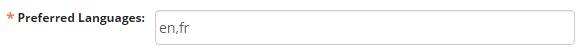

### 5. Forms: Questions

To create and import questions to a mission, navigate to the Questions page by clicking on the _**Questions**_ menu on the main menu bar.

> _**Note:** When creating a new question within the form, there are three options for questions available: conditional, hidden and required. Each of these options affects how the form is filled out by the user in the field. A question can be:_
> 
> *   _Conditional: whether or not it appears in the form is dependent upon how a previous question is answered_
> *   _Hidden: it is not shown on the form – only to be used if it cannot be deleted_
> *   _Required: it must be answered in order to submit the completed form, unless an override code is provided_

#### 5.1. Create a Question

To create a question that will be used for the current mission:

+ 1:  Click on the **_Create Question_** link (in orange text)
+ 2:  Provide a unique name for the question in the box labeled **_Code_**. Normal users (in this case, users with the title of Observer) will not see this box
+ 3:  Select the Type of response needed for the question from the following options:

#### 5.2. Types of questions

| Text            | Text designed with a shorter character limit, specifically used for SMS                                   |
|-----------------|-----------------------------------------------------------------------------------------------------------|
| Long Text       | Text designed for paragraphs rather than simple phrases/sentences                                         |
| Integer         | This is a numeric answer that must be a whole number without decimals                                     |
| Decimal         | This is numeric answer that allows for decimals                                                           |
| Location        | This question may be answered with a GPS coordinate derived from the user’s device (e.g. tablet with GPS) |
| Select One      | Only one answer may be selected from a multiple choice Option Set                                         |
| Select Multiple | Multiple answers may be selected from a multiple choice Option Set                                        |
| Date/Time       | Enter both the date and the time                                                                          |
| Date            | Enter the date                                                                                            |
| Time            | Enter the time                                                                                            |
| Image           | Take a picture or choose a jpg orpngimage                                                                 |
| Annotated Image | Take or choose a picture and annotate it                                                                  |
| Signature       | Sign with a finger                                                                                        |
| Sketch          | Sketch an image with a finger                                                                             |
| Audio           | Record or choose a sound                                                                                  |
| Video           | Record or choose a video                                                                                  |

+ 4:  After selecting the type of question (and option set if applicable), enter the main text of the question in the title box

A note on image, video, or audio submissions: those files can be big! Big files may also mean a lot of data costs as well. Consult with your ELMO or database administrator on best practices for your project.

#### 5.3. Creating Hints

+ 5:  Add further instructions in the **_Hint_** box below the **_Title_** box (i.e.: for a Select Multiple question, add “Select all that apply” in the **_Hint_** box)

+ 6:  Below the Hint box, there is an option to make the question a **_Key Question_**. This option allows responses to the form to be organized based on the response to the question. If this box is marked, a column showing these answers will be added in the Responses tab.
+ 7:  Click **_Save_** to generate the question
+ 8:  To edit the question, return to the Questions page and select the corresponding **_Pencil icon_**

#### 5.4. Language translations

Question titles and hints can be translated into any language that has been set for the mission. To add a language to a mission, go to the **_Preferred Languages_** box in the **_Settings_ **menu. When creating or editing questions, the **_Title_ **box will appear for the first language in **_Preferred Languages_**, followed by the **_Hint_** box in that language, then the **_Title_** and **_Hint_** boxes for the second language, and so on. So, a **_Preferred Languages_** box that looks like this:

Results in this:

To translate a title or a hint, type the translation in the corresponding box and click **_Save_**. To view the translation, change the language by clicking **_Change Language_** in the footer. Questions that have been translated into the selected language will appear translated once that language is selected. For example, the French translation of an English question will appear once French is selected.

#### 5.5. Tags

Tags are an easy way to organize information around a common keyword or theme. In ELMO, questions may be “tagged” with keywords or descriptors, which may be used to find all of the questions with the same tag. Tags are also used in Reports to help sort information assigned to questions.

To tag questions:

1.  Open or create the question you wish to tag.
2.  Type in the _**Tags**_ box. (You may add multiple tags.)
3.  Click **_Enter_** to add a tag.
4.  To delete a tag, click on the **_X_** next to the tag.
5.  Click **_Save_** after adding tags to save your changes.

