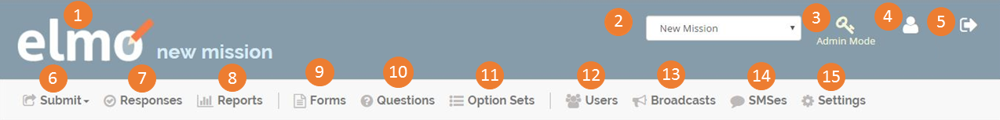
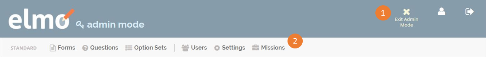

### Getting Started

#### 1.1\. What is ELMO?

ELMO is The Carter Center’s open-source ELection MOnitoring data collection and reporting system, built specifically with election monitoring in mind. Equipped with ELMO, observers can submit evaluations of a process – via tablets (utilizing Open Data Kit), SMS, or directly online – in real-time to field or _mission_ headquarters. ELMO’s reporting system organizes observer findings, and is relied upon by The Carter Center missions around the globe to analyze data and to assess elections as well as broader political processes.

The open source license for ELMO is Apache 2.0\. ELMO can be hosted on personal servers and users can control who has access to the data.

### 1.2\. System Requirements

ELMO Development Setup

https://github.com/thecartercenter/elmo/blob/master/docs/development-setup.md

### 1.3\. Viewing the Header

The header is the top section of the screen. Here are its components:

1.  The **Home** icon. Click this to return to the home page of the selected field project or _mission_.
2.  The mission selection box. Click this to display all missions that can be accessed by the user. Click on a mission to go to its home page, or click the box again to hide the list.
3.  The **Admin Mode** icon (Admins only). Click this to enter Admin Mode. The header in this mode looks different, but the function of each icon is the same. There are only two new icons, the functions of which will be discussed later.
4.  The edit profile icon. The icon shows your username and role. Click this to edit your profile.
5.  The **Logout** icon. Click this to log out of ELMO.
6.  The **Submit** menu. Click this to display a list of all published forms within the current mission. Click a form to fill it out and submit it, or click the menu again to hide the list.
7.  The **Responses** menu. Click this to go to the Responses page, which shows all responses that have been submitted to all forms within the mission.
8.  The **Reports** menu. Click this to go to the Reports page, where you can generate reports and see all of the reports that have already been generated within the mission.
9.  The **Forms** menu. Click this to go to the Forms page, where you can create and import forms and see all of the forms that have already been created in or imported to the mission.
10.  The **Questions** menu. Click this to go to the Questions page, where you can create and import questions and see all of the questions that have already been created in or imported to the mission.
11.  The **Option Sets** menu. Click this to go to the Option Sets page, where you can create or import option sets and see all of the reports that have already been created in or imported to the mission.
12.  The **Users** menu. Click this to go to the Users page, where you can:
    *  Create new users.
    *  See information on all users that have already been created.
    *  Export user information as a vCard.
    *  Send a broadcast to one or more users.
13.  The **Broadcasts** menu. Click this to go to the Broadcasts page, where you can send a broadcast to users and view broadcasts that have already been sent.
14.  The **SMS** menu. Click this to view all SMSes that have been sent and received by ELMO.
15.  The **Settings** menu. Click this to view and change your personal settings.

This is the version that Admins will see in Admin Mode:

There are only two new components:

1.  The **Exit Admin Mode** icon. Click this to exit admin mode.
2.  The **Missions** menu. Click this to go to the Missions page, where you can create a new mission and see all missions that have already been created.

### 1.4\. Viewing the Footer

The footer is the bottom section of the screen. Here are its components:

1.  The Language menu. Click _**Change Language**_ to reveal a list of all languages available. Click a different language to access that language’s online version of ELMO, or click the current language to close the list. **_Change Language_** will not return, but you can click on the current language to reveal the list again.
2.  The time zone the user has selected. This can be changed in the Settings menu.
3.  The outgoing SMS provider for the current mission (not shown in Admin mode).
4.  The current version number of ELMO being used.
5.  The About ELMO icon. Click this to go to getelmo.org.

>Note: ELMO online languages are slowly being built and increasing through volunteer efforts. Although the languages available of these are limited, ELMO is multilingual ready (ISO 639-2 standard) for questions and forms. The list of available languages is [here](https://www.loc.gov/standards/iso639-2/php/code_list.php).

### 1.5\. Viewing the Dashboard

The first visible screen when logged into ELMO is the Dashboard. This feature gives an overview of data gathered from responses to forms. Visible on the Dashboard screen are:

1.  Recent form responses
2.  An overview of geographic data submitted with responses
3.  An overview of all form submissions
4.  All reports created in the mission

>Note: The report with the most views will appear at the initial Dashboard screen
