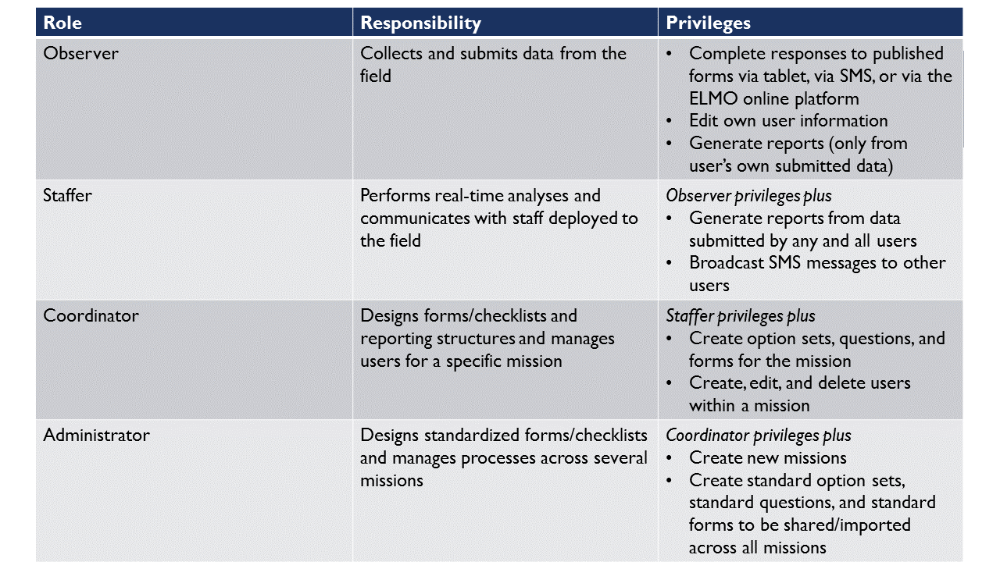
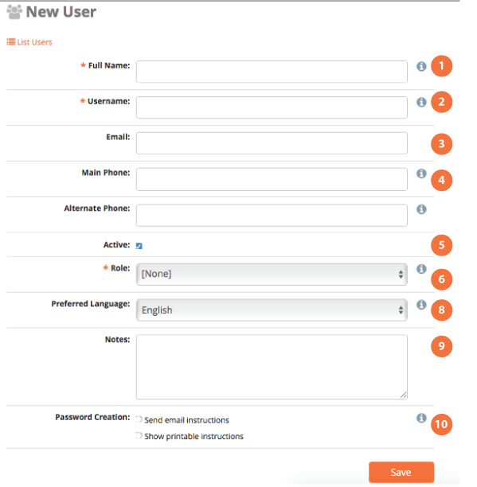

2. Setting up a Mission
~~~~~~~~~~~~~~~~~~~~~~~

Every instance of an ELMO database allows administrators to organize
field projects into areas called *missions*. For example, if you have a
project going on in two different countries, with different reporters or
observers, you may want to have two different missions: Country 1 and
Country 2.

2.1. Create a Mission (Admin only)
^^^^^^^^^^^^^^^^^^^^^^^^^^^^^^^^^^

Only administrators are able to work in ELMO in Mission Mode or Admin
Mode with an overall view of all missions; everyone else must be
assigned to a unique Mission. To create a mission, the Admin Mode must
be activated. To activate Admin Mode, click the *Admin Mode* menu
located in the top right corner of the screen. To create a mission:

1. Click the **Missions** menu located on the main menu bar at the top
   of the Admin Mode page
2. Once on the Missions page, click the orange **Create Mission** link
3. Enter a name for the mission: use only letters, numbers, and spaces

   1. Mission names usually include the country name and the year (i.e.
      Kenya 2013)
   2. Administrators have the option to lock a mission. When a mission
      is locked, Responses and Forms cannot be created or edited, and
      users cannot be added or deleted. To lock a mission, click the box
      labeled “\ **Locked?**\ “
   3. Click the **Save** button to save changes

4. Click **Exit Admin Mode** to return to Mission Mode
5. To locate the recently created mission, select the title of the
   mission in the drop down menu found in the top right corner, right of
   the Admin Mode selection
6. To set the appropriate time zone and language(s) for the mission,
   click the **Settings** menulocated on the main menu bar

       **Note:** To edit the name of a mission or to lock/unlock a
       mission after it has been created, Admin Mode must be activated.
       Once activated, click the Pencil icon (edit option) located to
       the right of the mission to be edited.*

2.2. User Permission Levels
^^^^^^^^^^^^^^^^^^^^^^^^^^^

ELMO has four kinds of user levels – observer, staffer, coordinator, and
administrator. Each user level has a different set of permissions based
on the functions they are expected to perform during ELMO missions.

2.3. Create Users
^^^^^^^^^^^^^^^^^

Create, delete, edit, and manage users on the Users page. Administrators
can create general users in Admin Mode and assign them to specific
missions, or they can create users for specific missions in Mission
Mode. Coordinators can only create new users in Mission Mode.

To create new users:

1. Determine whether to work in Admin Mode or Mission Mode,
2. Navigate to the Users page by clicking the **Users menu** on the
   main menu
3. Click Create User (located in orange text below the search bar)
   |New-user|
4. On the **Create User** page, new user information can be entered,
   including:

   1.  The user’s full name *required*
   2.  The login/username (click the suggest button to suggest a login
       name) *required*
   3.  The user’s email
   4.  The user’s phone number (must include country code)
   5.  Whether the user is “active”
   6.  The user’s role: observer, staffer, coordinator, administrator
       *required*
   7.  The user’s mission assignment(s) (Admin Mode only)
   8.  The user’s preferred language(s)
   9.  Notes about the user
   10. Preferences for password set-up for the user’s account (i.e.:
       password instructions delivered via email or printed out)

5. Click **Save.**

2.4. Create multiple users (ideal for adding a large number of users)
^^^^^^^^^^^^^^^^^^^^^^^^^^^^^^^^^^^^^^^^^^^^^^^^^^^^^^^^^^^^^^^^^^^^^

1. Click Create Multiple Users
2. Upload a spreadsheet with information for the new users.

   1. Click\_ **“Spreadsheet template”**\ \_ to download an example
      spreadsheet with the correct formatting for uploading multiple
      users.

      1. Outside of ELMO create a CSV or XLS file
      2. In the first row, include each of the following in its own
         column: Username \| Full Name \| Main Phone \| Alternate Phone
         \| Email \| Notes
          |Create Multiple Users|

3. Click Import.

2.5. Manage existing users
^^^^^^^^^^^^^^^^^^^^^^^^^^

1. To edit existing user information:

   1. find the user in the list of users, and
   2. Click on the **Pencil icon** located on the same line as the
      name (the second icon from the right).
   3. Click **Save.**

2. To export users’ information to a vCard, which is readable in
   Microsoft Outlook:

   1. Find each user whose vCard will be exported
   2. Check the box to the left of their name.
   3. Click on Export as vCard

3. To delete existing users:

   1. To delete a single user, click the **Trashcan icon** located to
      the right of the **Pencil icon**
   2. To delete multiple users, check the box to the left of their name
      and click **Delete Multiple Users.**

4. To send an email or SMS broadcast to users:

   1. Check the boxes next to each user to contact
   2. Click **Send Broadcast** (to the left of Export as vCard). This
      redirects to a page where you can define the medium, subject, and
      content of the broadcast.

2.6. Export VCard
^^^^^^^^^^^^^^^^^

To export users’ information to a vCard, which is readable in Microsoft
Outlook:

1. Find each user whose vCard will be exported
2. Check the box to the left of their name
3. Click on **Export as vCard**

2.7. User Groups
^^^^^^^^^^^^^^^^

In ELMO versions 5.7 and up, users can be placed into groups. Placing
users into groups makes it easier to search for users and send
broadcasts to them. To create a group of users:

1. Add multiple users to a mission
2. Click the \ **Users** tab
3. Check the box next to each user to be placed into the group
4. Click \ **Add Users to Group**
5. Click \ **Create New User Group**
6. Type the name of the group and click \ **OK**
7. Click the name of the group

To add users to a preexisting group, follow the same steps as above, but
skip numbers 5 and 6.

To view user groups, go to the \ **Users** tab and click \ **List
User Groups**. In the list, you can click:

1. **List Members**: click this to view a list of all users in the
   group
2. **Pencil** **icon** : click this to change the name of the user
   group
3. **Trashcan** **icon** : click this to delete the user group

.. |Create Multiple Users| image:: Create-Multiple-Users.png
