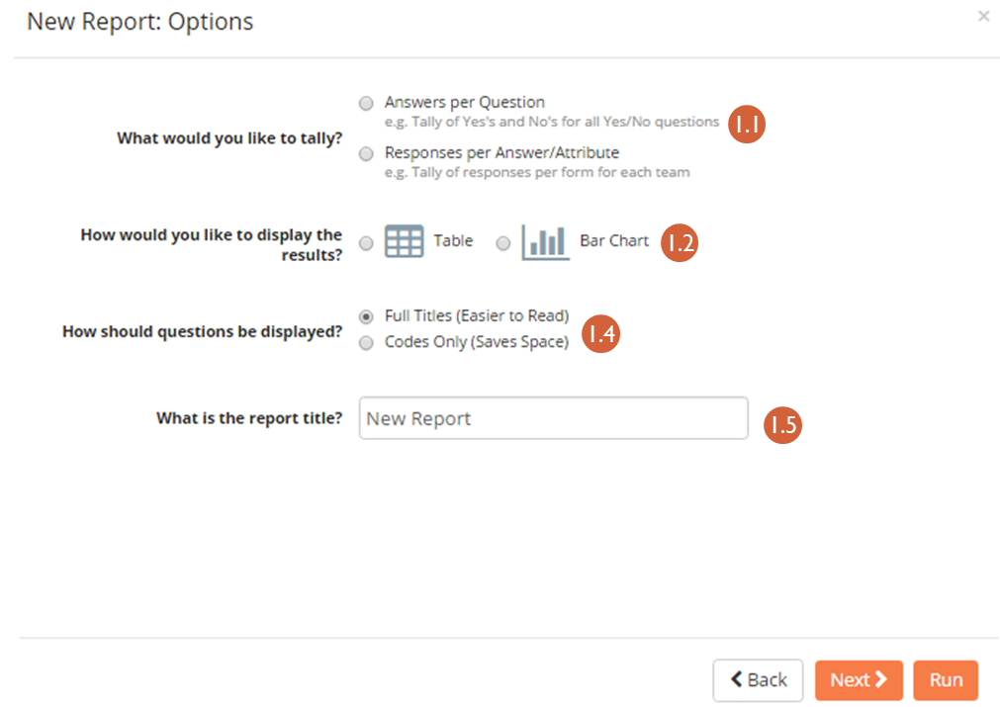
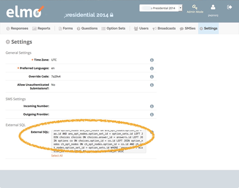
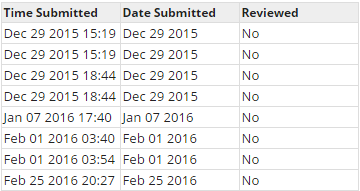
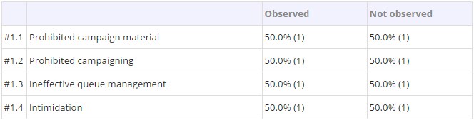

11. Reports and Data Analysis
~~~~~~~~~~~~~~~~~~~~~~~~~~~~~

ELMO stores and aggregates incoming data so that field and headquarters
staff can quickly chart, graph, and analyze information while writing
reports. These reports allow for preliminary conclusions to be made in a
timely manner. However, other tools may be more useful for more detailed
analysis. For this, data can be exported from ELMO for further review in
other analytical software.

11.1. Internal report building
^^^^^^^^^^^^^^^^^^^^^^^^^^^^^^

Submitted data can be visualized in the Reports section of ELMO. Click
the **Reports** menu on the main menu bar to access this section.
Coordinators can generate reports for response submissions from all
users while observers are only able to generate reports from their own
responses. To create a report, click the **Create a New Report** link
at the top of the page.

Three types of report options will be offered:

1. **Tally Report:** Shows totaled tallies of answers or responses,
   grouped by attributes of interest. Examples:

   -  **Table**
       |Tally Table Example|
   -  **Bar Chart**
       |Tally Bar Example|

If selected, the following prompts/options are available:

    1.  Tallies to show **Answers per Question** or **Responses per
        Answer/Attribute**
    2.  Data to be presented in a **Table** or **Bar Chart** format
    3.  **percentage style** (if **Table** is selected) or **bar
        style** (if **Bar Chart** is selected)

        1. **percentage style** – which percentages are displayed, if any;
           choices are **No Percentage**, **Percentage Overall**,
           **Percentage By Row**, and **Percentage By Column**
        2. **bar style** – which style the bar chart should be; choices
           are **Side By Side** and **Stacked**

    4.  How the titles should be displayed – **Full Titles** (Full text of
        questions) or **Codes Only** (Displays unique code assigned to
        question during its creation)
    5.  A title for the report
    6.  The form responses to include in the report
    7.  If **Answers per Question** is chosen:

        1. Calculations to apply – whether to show which answers are zero
           and greater than zero
        2. Which questions to include – choose specific questions or
           questions with specific option sets

    8.  If **Responses per Answer/Attribute** is chosen:

        1. Which attribute or question to use for the row headers
        2. Which attribute or question to use for the column headers

2.  **List Report**\ *:* A raw listing of answers and attributes for a
    set of responses. For example: |List Example|

    | If selected, the following prompts/options are available:
    | |list report options edited|

    1. How the titles should be displayed – **Full Titles** (Full text
       of questions) or **Codes Only** (Displays unique code given to
       question in the Question creation mode)
    2. A title for the report
    3. The form responses to include in the report
    4. Columns to include

3. **Standard Report**\ *:* A question-by-question summary of the
    responses for a specific form. The purpose of this report is to help
    give a ready-made overview of responses for a specific
    questionnaire.  For example: |Standard Form Example|

    | If selected, the following prompts/options are available:
    | |standard form report edited|

    1. Form to report on
    2. Whether to split the report by responses to a special question
    3. Whether to group questions by tag
    4. Whether to order questions **By Number** (the order they
       appeared in the form) or **By Type**
    5. How the titles should be displayed – **Full Titles** (Full text
       of questions) or **Codes Only** (Displays unique code given to
       question in the Question creation mode)
    6. Whether to show all text responses, not show long text responses,
       or not show any text responses
    7. A title for the report

11.2. Exporting to Spreadsheets (.csv)
^^^^^^^^^^^^^^^^^^^^^^^^^^^^^^^^^^^^^^

| If the options available within the Reports section do not meet
mission needs for analyzing collected data, the data can be exported to
a .csv file, a format readable in many quantitative and qualitative
analysis platforms (e.g Excel, R, Tableau, MaxQDA).
| To export data to a CSV file:

1. Click the **Responses** menu
2. Click **Export to CSV Format**

Tally and List Reports can also be exported to a CSV file:

1. Click the **Reports** menu
2. Click the report to be exported
3. Click **Export Data To CSV Format**

11.3. External connections - Tableau
^^^^^^^^^^^^^^^^^^^^^^^^^^^^^^^^^^^^

Tableau is a data visualization software that allows to present ELMO
data in a visually engaging and interactive fashion. If you love to use
Tableau and have a license, this is how to get started with ELMO.

Things that you will need are: SERVER credentials, and MySQL DATABASE
credentials. These are different from ELMO accounts or logins. These are
things that your ELMO administrator should have on hand.

**Establishing a Secure Tunnel**

In order to connect to Tableau, you will need to establish a “secure
shell tunnel” or encrypted connection between your computer and the
server that hosts ELMO. There are a number of ways that you can do this
such as clients such as PuTTY (for Windows) or direct through a
terminal. Check with your ELMO administrator for recommendations.

The registered port for MySQL connections is 3306.

An example of establishing the tunnel via terminal might look like this:

ssh –N –p 22 @ -L 9990//3306

which sometimes hangs even if success is achieved.

You may also have to make sure you have the appropriate ODBC drivers:

https://www.tableau.com/en-us/support/drivers

(so, n.b., if all this doesn’t make sense to you, find your local
friendly ELMO administrator who should be able to make sense of this!)

**Connecting Tableau to the Database**

1. Open Tableau.
2. Click **Data* **> **Connect to Data**\ …(or on the left
   **Connect* **\ sidebar, look under **To a Server**)
3. Select **MySQL**.
4. For server name, enter IP address
5. For port, enter the port you established through your tunnel session
   (in the example above it is 9990)
6. Enter the Database username and password. (this is not the same as
   the server credentials)

From there you should select the particular database instance that
houses your data.

**Making sense of the data in Tableau**

From this point onwards, there are a number of ways that you can examine
the data – if you need help to understand the tables and relationships,
check out the Entity Relationship Diagram on our GitHub at
https://github.com/thecartercenter/elmo/blob/master/docs/erd.pdf (also
available at the bottom half of the introductory GitHub page).

But, one way to easily get started is to take advantage of the custom
SQL query we provide in ELMO. For each mission, in the settings pane,
you can see a nifty ready query:

In Tableau, select the database and then

1. Select **Custom SQL**
2. Copy the Tableau SQL code from ELMO as it appears above.
3. Switch back to Tableau and paste the Tableau SQL code into the\*\*
   *Custom SQL*\ \*\*
4. In the final box, give the connection a name such as ‘Presidential
   Runoff 2014’. You will be able to reuse this connection with other
   worksheets.

Click **OK**. The Measures and Dimensions should appear in the left
panes.

.. |Tally Table Example| image:: Tally-Table-Example.png
.. |Tally Bar Example| image:: Tally-Bar-Example.png

.. |list report options edited| image:: list-report-options-edited.png

.. |standard form report edited| image:: standard-form-report-edited.png
