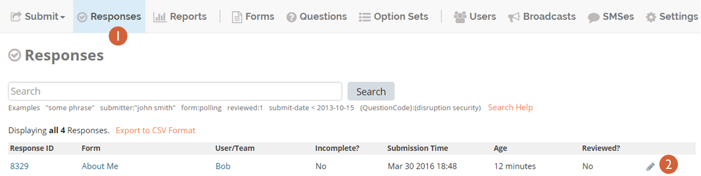
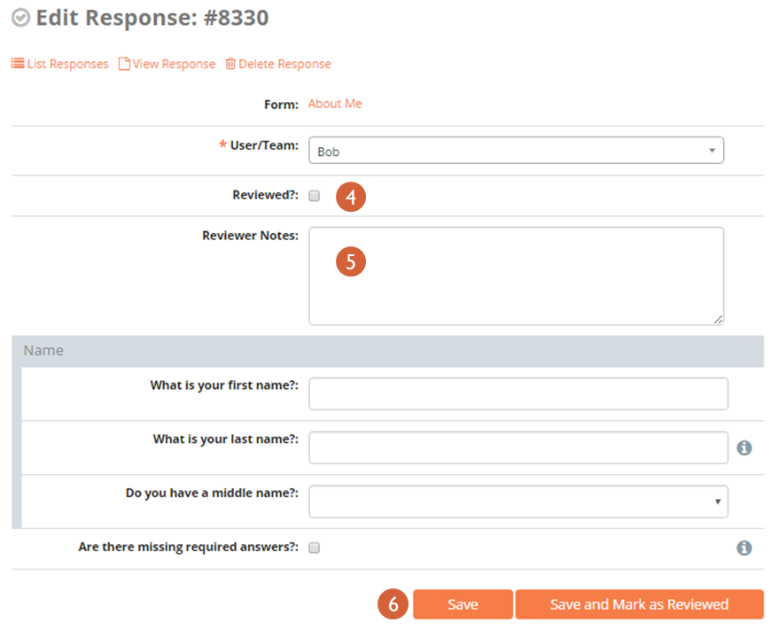

7. Submitting data: Online
~~~~~~~~~~~~~~~~~~~~~~~~~~

Forms can be submitted to ELMO through three different platforms:

1. Online (Via the ELMO website)
2. Via a tablet
3. Via SMS

To submit a form online:

1. Click the **Submit** menu on the main menu bar of ELMO
2. Click the form for which a response is being submitted
3. Complete the form
4. Click **Save**

To review a response:

1. Click the **Responses** menu
2. Click the pencil icon on the same row as the response to be reviewed
    |reviewing responses 1 edited|
3. Make any necessary changes to the form
4. Mark the box next to **Reviewed?** This flag is visible alongside
   each response under the **Responses** menu
5. If desired, add any notes in the text box next to **Reviewer
   Notes**
6. Click **Save**
    |reviewing responses 2 edited|

