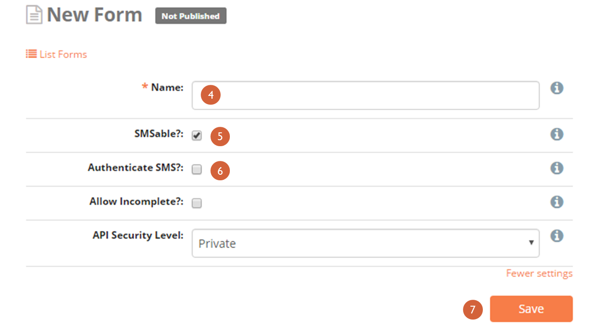
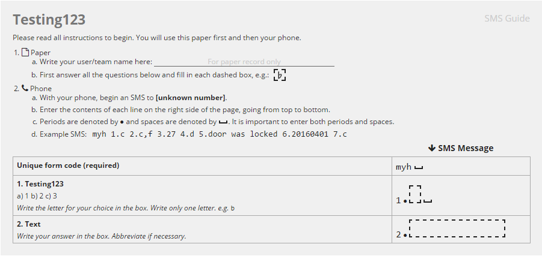
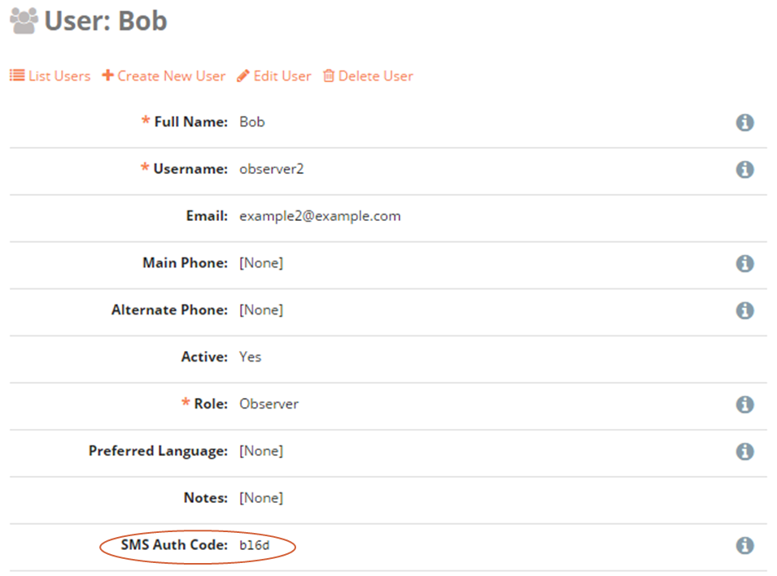
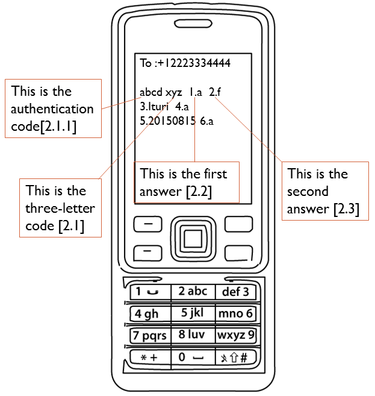

9. Submitting data: SMS
~~~~~~~~~~~~~~~~~~~~~~~

Forms can also be submitted via SMS. Any mobile phone with SMS
capability and access to a cellular network can be used to submit data
to ELMO.

Given the space limitations of texts, SMS-based forms are most powerful
when designed carefully. Certain types of questionnaires, such as
qualitative ones with long-text answers, are usually not a good fit.
However, SMS form submission allows the easy aggregations of large
amounts of data across distances without good mobile or internet
coverage. It also can be cheaper per observer, and may suit certain
monitoring and evaluation purposes, quantitative inquiries, or simple
surveys.

9.1. SMS Form Creation
^^^^^^^^^^^^^^^^^^^^^^

Creating an “SMS-able” form is similar to creating online and tablet
forms, there is just one additional flag to set:

1. Click the **Forms** menu
2. Click **Create New Form**
3. Click **More settings** (shown below)
    |More settings edited|
4. Enter a name for the form
5. Mark the box next to **SMSable?**

   1. If you need to forward all SMS form submissions to certain users,
      mark the box next to \ **SMS Forwarding?** and enter the names
      of the recipients in the next text box; more information on this
      can be found below

6. If a form’s submissions need to be authenticated, mark the box next
   to **Authenticate SMS?** (more information on SMS authentication
   can be found below)
7. Click **Save**

Once the form is published, an accompanying guide for observers is also
generated by ELMO. The “SMS Composition Guide” provides observers with
instructions for sending SMS responses, including a unique code for the
form. To view the guide:

1. Click on the **Forms** menu
2. Click on the form
3. Click on **View SMS Guide**

An example of the guide is shown below:

New to Version 5.8 is the ability to submit an SMS response that can
be relayed out to a selected group of people. The feature allows users
to be placed into groups that can be alerted that a submission has been
made to ELMO. This ability is called SMS Forwarding. If the \ **SMS
Forwarding?** box is checked, a copy of each SMS submission will be
sent via SMS to all users entered in the box \ **SMS Forward
Recipients**.

An example of an appropriate situation to use SMS Forwarding is: A team
wants to receive an alert when an incident form is submitted to the
system. The incident form is not a regular submission (one may be
submitted once every few days or less), so there may not be someone
logged into the system to see it submitted. When an incident is
reported, it is important to alert an entire group of responders that
something is going on. Thus SMS Forwarding should be enabled for this
form.

9.2. SMS Authentication
^^^^^^^^^^^^^^^^^^^^^^^

SMS Authentication is a feature that adds an extra measure of protection
against outside users from submitting forms to ELMO. Normally, ELMO only
accepts submissions that come from observers with their phone numbers
pre-registered in the system. Our SMS Authentication feature, when
enabled, works by requiring observers to provide an additional code when
submitting forms via SMS.

This four-character code is randomly assigned and unique to each user.
It is generated when an account is created. The code can be found by
clicking on the **Users** menu and then on the name of the user.

To generate a new authentication code:

1. Click **Edit User**
2. Click **Regenerate**
3. Click **Save**

Ideally, authentication codes should never be written down. Users should
memorize their codes. If a user forgets their code, an administrator
should generate a new one for them.

Activating SMS authentication adds extra security to ELMO by ensuring
that the registered phone number and the authentication code belong to
the same user. All SMS submissions that do not meet both these
conditions are rejected.

9.3. Submitting SMS responses
^^^^^^^^^^^^^^^^^^^^^^^^^^^^^

To submit forms to ELMO via SMS, the following is required:

1. Mobile phone
2. Phone credit
3. `SMS-able ELMO form <#sms-form-creation>`__ with three letter unique
   code listed in the SMS Composition Guide
4. ELMO number

To submit a form:

1. Choose a form to submit; only one form at a time can be submitted per
   SMS
2. Compose an SMS to the ELMO number:

   1. Begin your message with the three letter unique code, followed by
      a space

      -  If SMS authentication is required, type the authentication code
         first, then a space, then the form code |SMS example edited
         with text|

   2. Type the number of the question being answered, followed by the
      answer selected
   3. Type a space, followed by the next answer
   4. Repeat step 3 until all questions have been answered

      -  If not answering a question, skip that question number and
         answer in the SMS. For example, if question 4 were not being
         answered, the message would look like this: xyz 1.a  2.f 
         3.Ituri 5.20150815 6.a

   5. **Send** the message

.. |More settings edited| image:: More-settings-edited.png

