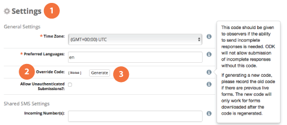

### 8. Submitting data: Tablet

Forms can be submitted via tablet. Any Android-based tablet with an Internet or mobile connection can be used to submit data to ELMO. While this section covers submission of forms via an app designed for form submissions, users may also use the browser app on the tablet to submit forms via ELMO Online. To submit forms via the tablet app, the following is necessary:

1.  Android-based tablet
2.  Internet or mobile connection
3.  ODK Collect app (via the Play store)

#### 8.1. Setup of Android tablet/phone

Forms are downloaded, filled out, and submitted in a program called ODK Collect. This program comes pre-loaded on Carter Center tablets, but can also be downloaded from the Play Store on the tablet:

1.  Press **_Play Store_**
2.  Search for “ODK Collect”
3.  Press **_ODK Collect_**
4.  Press **_INSTALL_**

Using ELMO via ODK Collect requires an ELMO username and password. To acquire these, contact an ELMO administrator. To enter these in ODK Collect:

1.  On the tablet’s home screen, press **_ODK Collect_**
2.  On the ODK Collect home screen, press the **_Menu_** button. This is located in the top right corner of the screen and appears as three gray squares in a vertical line.
3.  Press **_General Settings_**  
    
4.  Press **_Configure platform settings_**
5.  Press **_URL_**
6.  Type the URL of the mission (ex. https://example.getelmo.org/m/examplemission)
    1.  To find the URL of the mission, log in to ELMO Online and go to the mission’s home page by clicking the **Home** icon
    2.  Look in the address bar
    3.  The URL in the address bar is the same as the URL of the mission, but with the language designation (ex. /en or /fr) removed
7.  Press **_OK_**
8.  Press **_Username_**
9.  Type the username
10.  Press **_OK_**
11.  Press **_Password_**
12.  Type the password
13.  Press **_OK_**

#### 8.2. Downloading forms

A form must be downloaded to a tablet in ODK Collect before it can be submitted. To download a form:

1.  On the ODK Collect home screen, press **_Get Blank Form_**
    1.  A box may pop up asking for confirmation of username and password. If entered in General Settings, they should be correct. If not, type the correct username and password and continue.
    2.  If a screen other than the home screen is shown, press the **_Back_** button on the tablet until the home screen reappears.
2.  Mark the boxes next to the desired form(s)
3.  Press **_Get Selected_**

> _**Note:** In general, any changes made to forms by mission coordinators during active missions usually need to be downloaded again to the tablets. Coordinators should also guide observers to delete previous versions to prevent confusion. Good team communication is critical!_

#### 8.3. Submitting forms

To fill out and submit a form:

1.  On the ODK Collect home screen, press **_Fill Blank Form_**
2.  Press the form to be filled out
3.  Fill out the form
    1.  When obtaining GPS locations, stand outdoors. If indoors, stand by the nearest window.
4.  When the form is filled out, press **_Save Form and Exit_ **on the last screen
5.  On the ODK Collect home screen, press **_Send Finalized Form_**
6.  Mark the box next to the form
7.  Press **_Send Selected_**

#### 8.4. Editing forms before submission

To edit any answers to a form before submission, unmark the box on the last screen next to **_Mark form as finalized_** before pressing **_Save Form and Exit_**. Then:

1.  On the ODK Collect home screen, press **_Edit Saved Form_**
2.  Tap the form to be edited
3.  Tap a question to change its answer, or press **_Go To Start_** to review each question from the beginning.
4.  When finished with editing, mark the box next to **_Mark form as finalized_** before pressing **_Save Form and Exit_**

#### 8.5. Override Code

ELMO does not typically allow the observer to finalize and send in forms if there are required questions that haven’t been answered. However, some situations may arise in which forms need to be submitted without required questions being answered. For example, an observation may be cancelled after observers have been deployed; the observers cannot collect any new data, but the data they have collected is still useful. These observers can bypass the required question and submit the form by entering an override code. The override code is found and regenerated as needed by mission coordinators on the settings page of each mission, and then provided to observers when overrides are desired.

To generate an Override code:

1.  Click the **_Settings_** menu
2.  In the **_General Settings_** area, locate the current **_Override Code_** and write it down; the code will no longer be available to view after being regenerated  

    > _**Note:** If code regeneration is deemed necessary, the best practice is to regenerate the code BEFORE forms are downloaded by observer teams. This avoids complications with communicating code updates and keeping track of different versions of forms. As a rule of thumb, frequent regeneration of codes should not be necessary._

3.  Click **_Generate_** to obtain a new code

In order to use the override code, forms must be set to allow for incomplete responses. When creating or editing the relevant form, check the box that says **_Allow Incomplete?._** Once this is done, the form’s **_Allow Incomplete?_** setting should reflect **_Yes_** in the overall list of forms. If not initially set, forms have to be downloaded again by observers in order to take effect.

To submit an incomplete form with an override code, fill out the form as usual, other than the unanswered questions. At the end of the form, a question will appear: **_Are there missing required answers?_ **The options will be **_I don’t think so_** and **_Yes_**.

1.  Select **_Yes_**
2.  Alternatively, select **_I don’t think so_** to go back and answer the required questions
3.  Enter the override code

Once the override code has been obtained and successfully entered, the observer can mark the form as finalized and submit.
